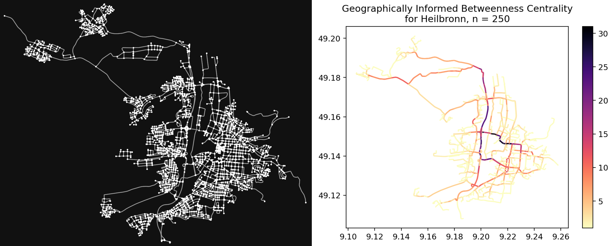

# Network Analysis - betweenness centrality calculation

The concept of centrality aims at analyzing networks and finding the most important nodes in them. These can be individuals in social networks, super-spreaders of diseases or key infrastructure nodes in urban networks[^1]. In road networks, not only nodes are of importance, but the edges also. "Betweenness centrality is a key metric for assessing node and edge importance in networks. It is based on computing the share of shortest paths that pass each edge or node in relation to the total number of paths in a network. Thereby it reveals the relative importance of edges or nodes for enabling interaction within the network"[^2].

This project implements multiple calculation methods for betweenness centrality, namely the networkx package with either a shortest or fastest route type method and the geographically informed betweenness centrality (GIBC) with different route sample sizes and either using random routes or using a population distribution based random route generation (PDBRRG).



## Prerequisites

- [Mamba](https://mamba.readthedocs.io/en/latest/index.html) (recommended) or [Conda](https://docs.conda.io/en/latest/)

## Installation

### 1. Download this repository

```console
$ git clone https://github.com/GrHalbgott/network-analysis.git
$ cd network-analysis
```

### 2. Setup new virtual environment with all necessary dependencies

```console
$ [mamba or conda] env create -f environment.yml
$ [mamba or conda] activate network-analysis
$ poetry install
```
Poetry will detect and respect an existing virtual environment that has been externally activated and will install the dependencies into that environment.

To update the packages to their latest suitable versions (and the poetry.lock file), run:
```console
$ poetry update
```

## Data (optional)

### AOI file

If you have an area of interest in the format GeoJSON, GeoPackage or ESRI Shapefile, you can put it into the `./data` folder.
It will be read automatically as long as you don't specify the `-skip` flag (see below).

### Population file

To acquire the population file needed to calculate random routes based on the population distribution, follow these steps:

1. Navigate to the [Global Human Settlement Layer](https://ghsl.jrc.ec.europa.eu/download.php?ds=pop) (note the product name GHS-POP)
2. On the left side, select the desired parameters (epoch, resolution and CRS), e.g. 2020, 100 m, Mollweide
3. Select your tile of interest, e.g. R4_C19 for Germany
4. Unzip the downloaded TIF file and put it in the folder `./data/`

[Example file](https://jeodpp.jrc.ec.europa.eu/ftp/jrc-opendata/GHSL/GHS_POP_GLOBE_R2023A/GHS_POP_E2030_GLOBE_R2023A_54009_100/V1-0/tiles/GHS_POP_E2030_GLOBE_R2023A_54009_100_V1_0_R4_C19.zip) for Southwest Germany

To use this in the program, you have to specify the `-pop` flag (see below).

## Run program

**Example**:

```console
$ python src/main.py -aoi Heilbronn -m gibc -n 250 -pop
```
This will calculate the **geographically informed betweenness centrality** for **250** random routes **based on the population distribution** in **Heilbronn, Germany** (skipping aoi file because none is found), using **fastest** (default with gibc) route types. The resulting files will be stored under **`./output/`** (default). The results can be seen [above](./README.md#network-analysis-using-betweenness-centrality-calculation).

**Usage**:

```console
$ python src/main.py -h

usage: main.py [-h] -aoi Area of interest [-skip] [-pop] [-n Number of routes] [-m Method] [-rt Route type] [-out Output directory]

Calculate betweenness centrality. You can use the following options to adapt the calculation to your needs. Have fun!

required arguments:
-aoi Area of interest  String | Name of the aoi (geocode or name of file)

optional arguments:
-skip                  Flag    | Use this to skip the aoi file in the data folder and query the -aoi instead.
-pop                   Flag    | Use this to use the population file (TIF file) to create random points depending on population density (during GIBC).
-n Number of routes    Integer | Number of routes to be calculated. Default value: 100
-m Method              String  | Method to calculate centrality {networkx/nx or geographical/gibc}. Default value: nx
-rt Route type         String  | Route type used for the calculation {shortest, fastest}. Default value: shortest
-out Output directory  String  | Name of output directory. Default value: output
```

## Testing

In order to run the tests in `./src/tests/`, you will need to install pytest into the environment:
```console
$ [mamba or conda] install -n network-analysis pytest
```

## Contribution

If you want to contribute code, please install the pre-commit package first to ensure that the code you provide suits the custom formatting rules before committing or creating a pull request.
Any advice, proposal for improvement or question is welcome!
```console
$ [mamba or conda] install -n network-analysis pre-commit
$ pre-commit install
```

## License

This project is licensed under the GPL-3.0-or-later License - see the [LICENSE](./LICENSE) file for details.

## Footnotes

If you have any questions or encounter a specific problem, feel free to use the Issues section of this repository to get in touch with me. I am looking forward to your ideas and input!

[^1]: Heuvel, M.P. van den and Sporns, O. (2013) ‘Network hubs in the human brain’, Trends in Cognitive Sciences, 17(12), pp. 683–696. Available at: https://doi.org/10.1016/j.tics.2013.09.012.

[^2]: Werner, C. and Loidl, M. (2023) ‘Supplementary materials to: Betweenness Centrality in Spatial Networks: A Spatially Normalised Approach’. Available at: https://doi.org/10.5281/ZENODO.8125632.
